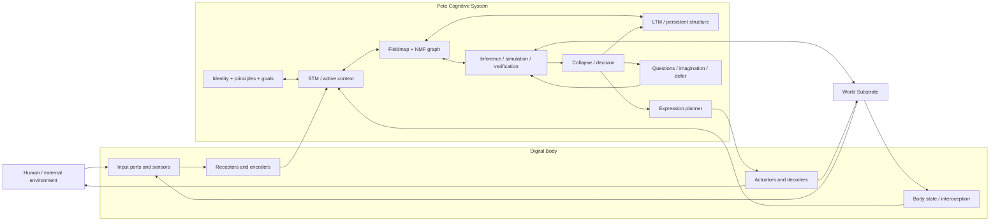
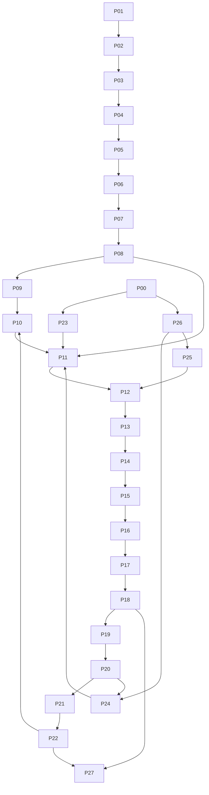

# Pete NMF–World Model Architecture

## Đặc tả kiến trúc triển khai cho một AI cấu trúc, có cơ thể số và không dùng LLM trong runtime

**Tác giả ý tưởng:** Kevin T.N.  
**Biên soạn kỹ thuật:** Codex, dựa trên principle, code, checkpoint và giải cấu trúc của Pete  
**Phiên bản:** 1.0 — 2026-09-13  
**Trạng thái:** Target architecture có mapping sang implementation hiện hữu; không tuyên bố mọi khối đã hoàn thành  
**Repository chính:** `pete_test`  
**World substrate:** sibling repository `pete-grounding`

---

## Tóm tắt

Pete là kiến trúc AI có tổ chức, không dùng Large Language Model làm bộ sinh câu trả lời hay fallback trong runtime. Pete không xem ngôn ngữ là chuỗi token cần dự đoán tiếp. Hệ chuyển tín hiệu thành cấu trúc có điều kiện, tổ chức cấu trúc trong Fieldmap, đối chiếu với ký ức và world model, tạo nhiều khả thể, kiểm điều kiện rồi mới collapse thành quyết định.

Kiến trúc có bốn tầng khác nhau nhưng nối thành một hệ:

1. **World substrate** chứa state và quy luật biến đổi thực thi được. Đây là thế giới vật lý mô phỏng của Pete, không phải bản thân thực tại khách quan.
2. **Digital body** là sensor, receptor, encoder, decoder và actuator bằng code. Đây là biên duy nhất qua đó Pete nhận hoặc tác động vào substrate và môi trường ngoài.
3. **Fieldmap/NMF** tổ chức Name–Meaning–Frame, quan hệ, ngữ cảnh, khả thể, evidence và activation. Đây là không gian nhận thức có cấu trúc, không phải engine vật lý.
4. **Cognitive process system** gồm các IPOD nhỏ nối thành đồ thị producer–consumer. Output process trước trở thành Input process sau; Data nằm trong state và đường vận động của toàn hệ.

Paper định nghĩa kiến trúc, process, interface và data contract. Việc chọn corpus, thuật toán học, loss, curriculum, optimizer và quy mô training thuộc implementation tiếp theo. Bất kỳ cách train nào cũng phải xuất đúng contract, giữ provenance, không rò test và chứng minh learned state thật sự ảnh hưởng hành vi.

---

## 1. Mục tiêu và ranh giới

### 1.1 Mục tiêu gốc

Goal dài hạn là tạo Pete thành một kiến trúc AI khác biệt, không phụ thuộc LLM, có thể:

- biết mình là hệ thống nào, đang có năng lực và giới hạn gì;
- hiểu input người dùng theo nghĩa có điều kiện trong ngữ cảnh;
- duy trì hội thoại nhiều lượt và phản hồi bằng ngôn ngữ;
- quan sát, dự đoán, hành động và học trong world substrate;
- duy trì vòng hoạt động khi không có input trực tiếp từ người;
- sinh câu hỏi từ gap, tạo khả thể mới, kiểm rồi tích lũy tri thức;
- về sau hiểu code và đề xuất tiến hóa qua sandbox/gate.

Mốc đầu là chatbot native hiểu bản thân, hiểu người dùng trong phạm vi đo được và tạo phản hồi có nguồn. Tool tổng quát, tự sửa code và thế giới mở nằm ở mốc sau.

### 1.2 Ranh giới tuyên bố

- World substrate là mô hình thực thi của một miền, không phải toàn bộ thực tại khách quan.
- Self-model và tự quan sát không tự chứng minh trải nghiệm chủ quan.
- Fieldmap chứa quan hệ và khả thể; có Fieldmap chưa có nghĩa hiểu đúng.
- Lưu data không đồng nghĩa học; test pass không đồng nghĩa người dùng hài lòng.
- Tương đồng với não/cơ thể/vật lý là mapping chức năng cần contract và evidence.

---

## 2. Khái niệm lõi

### 2.1 IPOD

Mỗi process và toàn hệ đều có thể nhìn như vòng:

- **Input:** tín hiệu/state đi vào qua port xác định.
- **Process:** biến đổi input dưới điều kiện và state hiện có.
- **Output:** state, tín hiệu, quyết định hoặc hành động mới.
- **Data:** cấu trúc được giữ và ảnh hưởng vòng sau.

Data không chỉ là file nằm yên. Nó còn nằm trong topology, weights, relation strength, activation, trạng thái cơ thể, đường truyền và lịch sử transition. Record không được process nào đọc thì chưa tham gia hoạt động nhận thức.

### 2.2 C/V — Constant và Variable

Mỗi hệ có invariant giữ nó là cùng một tổ chức trong frame đang xét và variable cho phép thích nghi/hành động. Một thứ có thể là constant ở scale này nhưng là variable ở scale khác. Record phải khai báo frame, scope, version và time.

### 2.3 Gap

Gap là khác biệt có kiểu:

- `state_gap`: state trước/sau;
- `goal_gap`: hiện trạng/goal;
- `semantic_gap`: nghĩa input/nghĩa Pete đang có;
- `frame_gap`: frame hoặc unit không tương thích;
- `evidence_gap`: thiếu bằng chứng;
- `process_gap`: output không consumer hoặc input không producer;
- `capability_gap`: body/process chưa cung cấp năng lực goal cần.

Gap cần `kind`, `scope`, `magnitude_or_description`, `evidence`, `owner`, `next_resolution_condition`.

### 2.4 NMF — Name, Meaning, Frame

- **Name:** tín hiệu/ký hiệu dùng để gọi.
- **Meaning:** vai trò, tác động và quan hệ trong tình huống.
- **Frame:** hệ quy chiếu nơi Meaning có hiệu lực: miền, goal, time, source, scale, unit và condition.

Không dùng mapping tuyệt đối `Name = Meaning`. Đơn vị là:

```text
(Name, Meaning, Frame, Evidence, Validity, Revision)
```

Cùng Name có nhiều Meaning trong nhiều Frame. Collapse xảy ra sau khi context, goal và evidence thu hẹp tập khả thể đủ để hành động.

### 2.5 Hiểu

Pete hiểu một tín hiệu trong phạm vi xác định khi có thể:

1. xác định Meaning phù hợp trong Frame;
2. mô tả quan hệ/vai trò với thành phần khác;
3. đánh giá ảnh hưởng đối với Goal: value, neutral, anti-value hoặc unknown;
4. chỉ ra điều kiện làm nghĩa/giá trị thay đổi;
5. chuyển cơ chế sang trường hợp mới và giữ invariant;
6. nhận ra phản chứng hoặc trường hợp cần thu hẹp;
7. dùng hiểu biết để dự đoán, quyết định hoặc giải thích kiểm được.

Nhận dạng mẫu, truy record hoặc tạo đúng một câu chưa đủ.

---

## 3. Kiến trúc tổng thể



### 3.1 Luật biên

Pete không đọc/sửa substrate trực tiếp từ cognition. Mọi tương tác đi qua body:

```text
Environment/Substrate → Sensor → Encoded Observation → Cognition
Cognition → Motor Intention → Actuator → Environment/Substrate
```

Nếu actuator không hỗ trợ action, planner giữ `UNEXECUTABLE`, không giả vờ đã làm.

### 3.2 Ba không gian

| Không gian | Chứa gì | Phép biến đổi | Tiêu chuẩn đúng |
|---|---|---|---|
| Substrate | state, entity, field, units, laws | `state_t + action → state_t+1` | invariant, solver, replay |
| Body | port, signal, encoding, capability | capture, filter, transduce, commit | access, fidelity, effect |
| Fieldmap | NMF, relation, activation, possibility | resonate, bind, compare, collapse | context, evidence, transfer |

Không dùng activation Fieldmap thay đại lượng vật lý; không dùng state substrate làm nghĩa ngôn ngữ nếu chưa binding.

---

## 4. World substrate

### 4.1 Vai trò và primitive

Substrate là thế giới code có logic biến đổi lấy từ các quan hệ con người ghi nhận về thực tại. Nó chứa công thức/rule thực thi, không chỉ tên định luật hoặc hằng số.

Primitive tối thiểu:

```text
ReferenceFrame, SpaceLattice/CoordinateSpace, Position, Entity,
Occupancy, State, Parameter, Interaction, Constraint,
TransformationLaw, Action, Observation, Clock/Tick, Transition, Evidence
```

### 4.2 Không gian, chiếm chỗ và thời gian

Representation tối thiểu có thể dùng lưới 3D. Node nền là vị trí cố định; khoảng cách chuẩn giữa node kề là một đơn vị. `1` trước hết biểu diễn tồn tại/đơn vị nền, không phải thứ tự. Tọa độ nguyên trùng node; tọa độ thực là vị trí nội suy khi domain cho phép.

`OccupancyConstraint` quy định một slot chứa gì và tương tác nào cần xảy ra để thực thể khác thay thế. Đây là rule của model Pete, phải version; không tự nhận là lý thuyết vật lý được xác nhận.

Time vận hành gồm state trước, state sau đủ khác để observer phân biệt, tick/duration theo clock contract và observer history. Global clock là quy ước đồng bộ; sensor vẫn có sampling time, latency và missing interval.

### 4.3 Transition contract

```json
{
  "transition_id": "tr-...",
  "world_id": "world-...",
  "frame_id": "frame-...",
  "tick_before": 120,
  "tick_after": 121,
  "state_before_hash": "sha256:...",
  "action": {"actor_id": "body-...", "type": "apply_force", "parameters": {"axis": "x", "magnitude": 0.2, "unit": "N"}},
  "laws_applied": ["newton-2@v1"],
  "constraints_checked": ["occupancy@v1"],
  "state_after_hash": "sha256:...",
  "observations_emitted": ["obs-..."],
  "solver": {"name": "...", "version": "...", "dt_s": 0.01},
  "provenance": {"source": "simulation", "scenario_hash": "..."}
}
```

### 4.4 Environment và internal model

- `WorldEnvironment` thực thi transition và phát public observation.
- `InternalWorldModel` dự đoán transition từ những gì Pete quan sát/học.

Learner không đọc private coefficients của environment:

```text
commit prediction → execute action → receive public observation
→ compare prediction/outcome → update internal model
```

### 4.5 Interface substrate

```python
class WorldSubstrate(Protocol):
    def reset(self, scenario_ref: str, seed: int) -> PublicObservation: ...
    def observe(self, request: SensorRequest) -> PublicObservation: ...
    def validate_action(self, command: ActuatorCommand) -> ActionValidation: ...
    def step(self, command: ActuatorCommand) -> TransitionReceipt: ...
    def checkpoint(self) -> WorldCheckpoint: ...
    def replay(self, checkpoint: WorldCheckpoint, commands: list[ActuatorCommand]) -> list[TransitionReceipt]: ...
```

Quantity cần `value`, `unit`, `frame`, `timestamp/tick`, `precision`, `source`.

---

## 5. Cơ thể số

### 5.1 Vai trò

Cơ thể số là code cứng tạo khả năng/giới hạn tương tác. Nó là bộ nhận tín hiệu, mã hóa/giải mã, lọc băng thông, bảo vệ quyền, tác động, interoception và capability registry. Đây là tương đương tay chân/giác quan theo chức năng.

### 5.2 Port contract

```json
{
  "port_id": "substrate-sensor",
  "direction": "input",
  "signal_kinds": ["external_observation", "sensed_consequence"],
  "medium": "typed-packet",
  "max_bytes": 16384,
  "rate_limit": {"packets_per_tick": 1},
  "accepted_frames": ["pendulum-public@v1"],
  "encoder": "substrate-observation-encoder@v1",
  "owner": "digital-body",
  "enabled": true
}
```

Port MVP: `human-text-input`, `human-text-output`, `self-model-storage`, `memory-reactivation`, `body-state`, `substrate-sensor`, `substrate-actuator`, `journal-interoceptor`, `dialogue-state`.

### 5.3 Signal lifecycle và actuation

```text
raw signal → boundary validation → immutable capture packet
→ normalization preserving raw form → structural encoding → cognitive event
```

Packet giữ raw reference, normalized form, timestamp, source, port, truncation/loss, encoder version.

Actuator nhận `MotorIntention`, xác minh capability/scope, dịch thành command, nhờ environment validate, commit một lần bằng idempotency key và trả receipt.

```json
{
  "intention_id": "mi-...",
  "goal_id": "goal-...",
  "actuator_port": "substrate-actuator",
  "action_type": "apply_force",
  "parameters": {"axis": "x", "magnitude": 0.2, "unit": "N"},
  "preconditions": ["entity-visible", "budget-ok"],
  "expected_effect": "prediction-...",
  "idempotency_key": "..."
}
```
---

## 6. Fieldmap và NMF

### 6.1 Vai trò

Fieldmap là graph động chứa cấu trúc được kích hoạt theo ngữ cảnh. Node có thể là entity, meaning, frame, relation, goal, process, evidence, question, action hoặc invariant. Edge là quan hệ có kiểu và điều kiện.

Fieldmap cung cấp nhiều Meaning cho cùng Name; cộng hưởng từng phần thay vì lookup nguyên record; lan activation; binding language–memory–goal–observation; giữ khả thể chưa collapse; truy provenance và invalidation.

### 6.2 Node schema

```json
{
  "node_id": "nmf:paris:city:geopolitical",
  "node_type": "concept",
  "name": {"surface": "Paris", "language": "fr", "aliases": ["paris"]},
  "meaning": {"type": "city", "roles": ["capital"], "properties": {"canonical_entity": "geo:paris"}},
  "frames": ["geopolitical/nation-state@2026"],
  "activation": {"value": 0.0, "updated_at_tick": 0, "decay_policy": "stm-default@v1"},
  "evidence_refs": ["evidence-..."],
  "validity": {"status": "admitted", "conditions": [], "reopen_on": ["contradiction"]},
  "revision": 3
}
```

### 6.3 Edge schema

```json
{
  "edge_id": "edge-...",
  "from": "geo:paris",
  "relation": "CapitalOf",
  "to": "geo:france",
  "frame": "geopolitical/nation-state@2026",
  "conditions": [],
  "polarity": "affirmed",
  "strength": 0.91,
  "strength_semantics": "learned-accessibility-not-truth-probability",
  "evidence_refs": ["evidence-..."],
  "provenance": {"source_id": "...", "method": "..."},
  "valid_from": "...",
  "valid_until": null,
  "invalidation_rules": ["source-retracted", "frame-changed"]
}
```

Mỗi số phải khai báo nó đo gì; không gọi mọi giá trị 0–1 là confidence/probability.

### 6.4 Resonance

Resonance so tương thích input pattern với cấu trúc hiện có. Contract trả:

```text
matched_dimensions, unmatched_dimensions, candidate_frames,
source_nodes, activation_delta, ambiguity, explanation_trace
```

Kích hoạt mạnh không tự thành fact. Candidate chỉ được admit qua evidence/verification.

### 6.5 Collapse

Collapse chọn một khả thể trong frame cụ thể và giữ candidate set, evidence/condition, selected candidate, lý do loại/defer, single commit owner và reopen condition. Nếu không candidate đạt gate, output hợp lệ là `UNKNOWN`, `DEFER`, `ASK`, `OBSERVE_MORE` hoặc `DECLINE_ACTION`.

---

## 7. Memory và observer

### 7.1 STM

STM là active workspace, không chỉ transcript gần nhất:

```json
{
  "session_id": "...",
  "turn_id": "...",
  "active_entities": [],
  "active_frames": [],
  "active_goals": [],
  "pending_questions": [],
  "deferred_items": [],
  "recent_observations": [],
  "recent_decisions": [],
  "activation_snapshot_ref": "...",
  "body_state_ref": "...",
  "world_state_ref": "...",
  "revision": 1
}
```

STM có budget/decay. Eviction phải giữ summary có nguồn hoặc link retained structure; không lặng lẽ mất obligation.

### 7.2 LTM

LTM gồm identity/principle; admitted concepts/relations/procedures; episodic transitions; learned weights/topology; capability models; evidence registry; contradictions; decisions và failure patterns. Không bắt buộc một DB, nhưng cần stable ID, schema version, hash và access interface chung.

### 7.3 Memory without retrieval

Input có thể kích hoạt trực tiếp cấu trúc đã hình thành. Có hai đường:

1. Explicit retrieval theo ID/relation/frame.
2. Structural reactivation do pattern tương thích, kể cả chưa định vị record hoàn chỉnh.

Reactivation chưa giải thích mang nhãn `UNLOCATED_INFLUENCE`, không được nâng thành truth.

### 7.4 Observer

Observer tự đổi khi capture signal. Observation nên giữ:

```text
observer_before_hash, stimulus_ref, encoding_trace,
observer_after_hash, recognized_dimensions, unrecognized_activation
```

Nhờ đó trải nghiệm đổi cách Pete quan sát lượt sau; identity/principle update vẫn qua policy riêng.

---

## 8. Đồ thị process

### 8.1 Process contract

```json
{
  "process_id": "P06-context-resonance",
  "version": "1.0",
  "input_types": ["NMFTokenCandidates", "STMState"],
  "output_types": ["ContextBindingSet"],
  "reads": ["fieldmap.activation", "stm.active_frames"],
  "writes": ["fieldmap.activation_delta"],
  "preconditions": [],
  "trigger": "event:nmf-candidates-ready",
  "owner": "context-engine",
  "idempotency_key": "event_id+process_version",
  "failure_outputs": ["UNKNOWN_FRAME", "AMBIGUOUS_BINDING"],
  "evidence_emitted": ["ProcessTrace"]
}
```

Side effect phải khai báo. Function trả `None` vẫn có Output nếu sửa state/phát event.

### 8.2 Registry tối thiểu

| ID | Process | Input | Output | Data đọc/ghi |
|---|---|---|---|---|
| P00 | Lifecycle tick | clock, body | tick event | runtime status |
| P01 | Boundary capture | port signal | immutable packet | raw store |
| P02 | Signal normalization | packet | signal + loss | encoder registry |
| P03 | Symbol segmentation | normalized signal | symbols | lexicon |
| P04 | Structural receptor | symbols | role/dependency candidates | receptor weights |
| P05 | NMF resolution | symbols, receptor | NMF candidates | Fieldmap |
| P06 | Context resonance | candidates, STM | bindings/frames | activation |
| P07 | Semantic graph assembly | bindings | semantic graph | relation schemas |
| P08 | Input-mode classification | graph, dialogue | assertion/question/request/etc. | intent structures |
| P09 | Gap detection | graph, state | typed gaps | gap ledger |
| P10 | Memory reactivation | graph/pattern | activated structures | LTM/episodes |
| P11 | Goal routing | intent, gap, identity | goal/subgoals/defer | goal graph |
| P12 | Candidate generation | goal, graph, memory | answer/action/question candidates | procedures/imagination |
| P13 | Prediction | candidate, world model | committed prediction | model state |
| P14 | Verification | candidate, evidence, substrate | verification result | facts/rules |
| P15 | Collapse/decision | verified candidates | intended structure | decision chain |
| P16 | Semantic output planning | intended structure | response/information plan | discourse policy |
| P17 | Grammar/style realization | response plan | string/tokens | grammar/lexicon |
| P18 | Actuator commit | motor intention | receipt | body capability |
| P19 | Consequence observation | receipt, sensors | outcome | episode transition |
| P20 | Comparator | prediction, outcome, goal | residual/gap/value | metrics |
| P21 | Learner/update proposal | residual, trace | update proposal | weights/topology |
| P22 | Admission/commit | proposal, evidence gate | LTM revision/rejection | provenance |
| P23 | Self-observation | journal, capability, errors | self-state update | self model |
| P24 | Endogenous question | unresolved gaps | question/investigation goal | question queue |
| P25 | Idle imagination | budget, structures | hypothetical candidates | imagination workspace |
| P26 | Scheduler | events, attention, resource | dispatch/defer | queues/ledger |
| P27 | Checkpoint/recovery | state revisions | durable checkpoint | manifest/journal |

### 8.3 O → I



### 8.4 Đồng thời và commit

Sau P02 có thể song song receptor ngôn ngữ, provenance inspection, STM reactivation và interoception. Chỉ merge typed output; P07/P08 không đọc state đang sửa dở.

P12 có thể tạo nhiều candidate đồng thời. P13/P14 đánh giá độc lập nếu không dùng mutable state chung. P15 là single commit owner cho decision revision.

Rule concurrency:

1. Event có ID/revision.
2. Process idempotent theo `(event_id, process_version, input_hash)` hoặc khai báo không idempotent.
3. Shared state có một owner; worker gửi proposal.
4. Merge chỉ nhận output cùng frame/version.
5. Side effect ra ngoài chỉ sau commit.
6. Late result từ revision cũ bị `STALE`.

---

## 9. Pipeline ngôn ngữ NMF

### 9.1 Language → Meaning

```text
text packet → segmentation → structural receptor
→ per-symbol NMF candidates → STM/context resonance
→ frame selection retaining ambiguity → semantic graph
→ input mode → query/assertion/request structure
```

Ví dụ “Paris là thủ đô của nước nào?”:

```json
{
  "input_mode": "query",
  "semantic_graph": {
    "nodes": [
      {"id": "geo:paris", "type": "city"},
      {"id": "?country", "type": "country", "variable": true}
    ],
    "edges": [{"subject": "geo:paris", "relation": "CapitalOf", "object": "?country"}]
  },
  "frame": "geopolitical/nation-state@current",
  "requested_output": "bind:?country"
}
```

### 9.2 Query và verification

```text
semantic query → retrieve candidates → filter type/frame/time
→ rank contextual fit/evidence → verify relation/source → resolve or UNKNOWN
```

```json
{
  "binding": {"?country": "geo:france"},
  "relation": ["geo:paris", "CapitalOf", "geo:france"],
  "frame": "geopolitical/nation-state@current",
  "status": "VERIFIED_WITHIN_FRAME",
  "evidence_refs": ["..."],
  "reopen_on": ["time_scope_changed", "source_invalidated"]
}
```

### 9.3 Meaning → Language

```text
verified meaning → response act → information/discourse plan
→ sentence structure → lexical selection → grammar realization
→ style/language adjustment → boundary validation → text actuator
```

Surface realization không tự thêm fact ngoài plan. Span nên truy về semantic node/discourse operation.

```json
{
  "response_act": "direct_answer",
  "claims": ["claim-1"],
  "sentence_plan": [{"subject": "Paris", "predicate": "là thủ đô của", "object": "Pháp"}],
  "style": {"language": "vi", "register": "neutral", "verbosity": "short"}
}
```

### 9.4 Input modes MVP

Assertion, yes/no question, wh-question, definition, semantic/role query, provenance query, request, denial/negation, conditional, comparison, correction, follow-up có reference/ellipsis, unknown/unsupported/malformed. Classifier chỉ đề xuất; semantic graph/context xác nhận.
---

## 10. Goal, attention, question, scheduler và defer

Các khái niệm này là node kéo context và điều kiện lựa chọn, không chỉ câu lệnh code cứng.

### 10.1 Goal graph

```json
{
  "goal_id": "goal-...",
  "parent_goal_id": "goal-root-survive-develop",
  "predecessor_goal_id": "...",
  "successor_conditions": [],
  "desired_state": {},
  "metrics": [],
  "constraints": [],
  "priority_inputs": ["identity", "human_commitment", "resource_state"],
  "status": "active",
  "evidence_of_completion": [],
  "reopen_conditions": []
}
```

Goal có vị trí trong cây lớn hơn và chuỗi predecessor–successor.

### 10.2 Attention

Attention phân bổ tài nguyên theo goal relevance, urgency/resource pressure, expected information gain, unresolved obligation, novelty/contradiction, cost và khả năng hoàn thành. Attention không xác nhận truth.

### 10.3 Question

Question sinh từ gap có khả năng đổi quyết định. Record cần `gap_ref`, `answer_type`, `who_can_answer`, `cost`, `blocking`, `expiry`, `what_changes_if_answered`.

### 10.4 Defer

```json
{
  "defer_id": "...",
  "item_ref": "candidate-...",
  "reason": "insufficient evidence",
  "wake_on": ["new-source", "human-answer", "resource-level-normal"],
  "expires_at": null,
  "retained_context_refs": [],
  "status": "waiting"
}
```

Defer không phải quên hoặc idle giả; scheduler đánh thức theo condition.

---

## 11. Dữ liệu cần có

### 11.1 Các họ dữ liệu

| Họ | Mục đích | Đơn vị mẫu | Output |
|---|---|---|---|
| Symbol/structure | segmentation, dependency, roles | câu + token span + typed relations | receptor structure |
| NMF grounding | Name–Meaning–Frame | mention + context + candidate meanings | NMF bindings |
| Dialogue | STM, reference, correction | conversation episode | dialogue transitions |
| Knowledge/evidence | fact, condition, provenance | claim + source + frame/time | admitted/rejected relation |
| Goal/action | intent → goal → action | episode + candidate actions | goal binding/decision |
| World transition | prediction/action/outcome | transition episode | world-model update |
| Self-model | capability, failure, resource | runtime trace | calibrated self-state |
| Surface realization | meaning graph → language | verified graph + plan + text | grammar/style structures |
| Counterexample | ambiguity, negation, frame conflict | contrastive set | invalidation boundaries |
| Transfer | same mechanism, new frame | source/target tasks | invariant + remapping |

### 11.2 Episode envelope

```json
{
  "episode_id": "ep-...",
  "split": "train|validation|test|online-adaptation",
  "family_id": "paraphrase-or-scenario-family",
  "source": {"dataset": "...", "license": "...", "revision": "...", "sha256": "..."},
  "environment": {"id": "...", "version": "...", "seed": 11},
  "initial_state_ref": "...",
  "events": ["event-1", "event-2"],
  "final_state_ref": "...",
  "labels": {"producer": "human|rule|model|measurement", "privileged": false},
  "leakage_group": "..."
}
```

### 11.3 Event envelope

```json
{
  "event_id": "evt-...",
  "event_type": "semantic-graph-ready",
  "producer_process": "P07",
  "producer_revision": "...",
  "created_at": "...",
  "frame": "...",
  "payload_schema": "SemanticGraph/v1",
  "payload_ref": "content-addressed://sha256/...",
  "input_refs": [],
  "trace_id": "trace-...",
  "causal_parent_ids": [],
  "confidence_semantics": null
}
```

### 11.4 Split và nguồn

- Split theo conversation/paraphrase/source/scenario/world-parameter family; không random các step kề nhau.
- Test khóa trước chọn cơ chế.
- Evaluation không update learned state, trừ suite online-adaptation có prefix/suffix riêng.
- Synthetic, human-authored, model-generated, documented và measured data có nhãn khác nhau.
- Data LLM tạo offline được dùng nếu khai báo supervision; runtime không fallback LLM.

### 11.5 Evidence

```json
{
  "evidence_id": "evidence-...",
  "claim_or_transition_ref": "...",
  "kind": "measured|simulated|documented|human-declared|derived|hypothesis",
  "source_uri": "...",
  "source_revision": "...",
  "captured_at": "...",
  "scope": "...",
  "method": "...",
  "content_hash": "sha256:...",
  "supports": [],
  "contradicts": [],
  "limitations": [],
  "admission_status": "pending"
}
```

### 11.6 Các state không được trộn

1. `supplied_prior`: cấu trúc người/code cấp.
2. `learned_persistent`: weight/topology update từ data.
3. `activation_transient`: context/resonance hiện thời.
4. `evidence_uncertainty`: evidence, ambiguity, unknown.
5. `runtime_body_state`: resource, capability, error.
6. `environment_state`: substrate sở hữu.

---

## 12. Training contract

Paper không chọn thuật toán. Có thể dùng count-based, graph learning, local regression, differentiable module, program induction hoặc kết hợp nếu giữ contract.

### 12.1 Input trainer

- versioned dataset manifest;
- frozen schema;
- declared priors;
- family split train/validation/test;
- seed, compute budget, environment version;
- initial model/Fieldmap hash.

### 12.2 Output trainer

```json
{
  "model_id": "...",
  "component": "receptor|nmf-binding|world-predictor|surface-realizer",
  "algorithm": "...",
  "prior_refs": [],
  "training_manifest_hash": "...",
  "learned_state_ref": "...",
  "parameter_or_edge_count": 0,
  "validation_metrics": {},
  "failure_groups": [],
  "source_code_hash": "...",
  "replay_command": "..."
}
```

### 12.3 Gate

- Ablate learned state phải đổi behavior theo dự đoán.
- Shuffle binding phải làm giảm đúng năng lực phụ thuộc binding.
- Frozen baseline dùng cùng observation/action budget.
- Test không mutate model.
- Reload checkpoint tái lập prediction trong tolerance.
- Unknown/frame conflict đo riêng.
- Báo theo family/episode, không xem transitions kề nhau là mẫu độc lập.
- Học trong simulation chỉ chứng minh trong simulation đó.

---

## 13. Persistence và storage

### 13.1 Content-addressed checkpoint

```text
checkpoint/
├── manifest.json
├── body-state.json
├── stm.json
├── fieldmap.snapshot
├── ltm.index
├── goal-graph.json
├── scheduler.json
├── process-offsets.json
└── journal.jsonl
```

Payload lớn lưu theo hash; event giữ reference.

### 13.2 Journal append-only

Ghi process start/end/failure; I/O hash; revision trước/sau; candidate/collapse; action receipt; learning proposal/admission; checkpoint/restart; stop reason. Correction tạo event mới trỏ event cũ, không sửa lịch sử.

### 13.3 State owner

| State | Owner duy nhất |
|---|---|
| environment state | substrate engine |
| body capability/ports | digital body |
| STM revision | context host |
| Fieldmap persistent graph | Fieldmap store |
| session activation | activation host |
| goal graph | goal host |
| decision commit | collapse host |
| LTM admission | knowledge admission host |
| journal | append-only journal writer |


### 13.4 Logical storage tables

Storage engine có thể là SQLite, graph database hoặc file store, nhưng logical model tối thiểu gồm:

| Table/collection | Primary key | Quan hệ chính |
|---|---|---|
| `events` | `event_id` | producer, causal parents, payload hash |
| `state_revisions` | `(state_owner, revision)` | previous revision, manifest hash |
| `nmf_nodes` | `node_id` | Name, Meaning, Frames, validity |
| `nmf_edges` | `edge_id` | from, relation, to, conditions |
| `activation_snapshots` | `(session_id, tick)` | transient node/edge activation |
| `evidence` | `evidence_id` | source, scope, supports/contradicts |
| `episodes` | `episode_id` | event sequence, split, source |
| `goals` | `goal_id` | parent, predecessor, successor |
| `questions_deferred` | `item_id` | gap, wake condition, status |
| `candidates` | `candidate_id` | goal, prediction, verification |
| `decisions` | `decision_id` | candidate set, selected, reopen |
| `world_transitions` | `transition_id` | before/action/after/solver |
| `learning_updates` | `update_id` | residual, affected state, admission |
| `checkpoints` | `checkpoint_id` | all owner revisions and hashes |

Foreign key/reference không được trỏ mơ hồ vào “latest”; event đã ghi phải giữ revision cụ thể.

---

## 14. Runtime lifecycle

### 14.1 Boot

```text
verify code/config hashes → load identity/principles
→ load body ports/capabilities → restore checkpoint/journal offsets
→ verify Fieldmap/LTM/world-model revisions
→ connect substrate through body → start scheduler → BOOT_READY
```

Checkpoint hỏng dẫn tới `RECOVERY_REQUIRED`; không âm thầm tạo state mới rồi nhận là liên tục.

### 14.2 Vòng sống không input người

```text
clock tick → interoception → resource/obligation scan
→ wake pending/deferred → reactivate gaps
→ choose observe/think/imagine/maintain/wait
→ bounded process → compare effect → persist → next tick
```

Chạy lâu dài không có nghĩa luôn tiêu CPU hoặc luôn sinh tri thức. Khi không có event hữu ích, scheduler chờ có điều kiện và giữ heartbeat/checkpoint.

### 14.3 Stop

Stop ưu tiên cao: ngừng nhận work mới; hoàn tất/cancel side effect theo contract; ghi state/offset; đóng ports; phát `STOPPED_CLEANLY`.

### 14.4 Runtime coordinator pseudocode

```python
while lifecycle.running:
    incoming = body.poll() + scheduler.wake_ready(clock.tick())
    if not incoming:
        checkpoint_if_due()
        scheduler.wait_until_event_or_deadline()
        continue

    immutable_events = [boundary.capture(signal) for signal in incoming]
    ready = process_registry.resolve_ready(immutable_events, current_revisions())
    proposals = execute_independent_processes(ready)
    typed_outputs = reject_stale_or_invalid(proposals)

    for owner, owner_proposals in group_by_state_owner(typed_outputs):
        committed = owner.validate_and_commit(owner_proposals)
        journal.append(committed.trace)
        event_bus.publish(committed.events)

    body.commit_only_validated_motor_intentions()
    compare_predictions_with_new_outcomes()
    checkpoint_if_due()
```

`execute_independent_processes` có thể song song; `validate_and_commit` tuần tự theo từng state owner. Coordinator không tự tạo meaning hoặc fact, nó chỉ tổ chức event/process/commit.
---

## 15. Interface giữa các repository

### 15.1 `pete_test`

Sở hữu identity/principles/goal; digital body host; native language/NMF; STM/LTM orchestration; scheduler/collapse/dialogue; journal, admission và surface output.

### 15.2 `pete-grounding`

Sở hữu executable substrate domains; state/units/frames/constraints; sensors/interactions/action validation; simulation/checkpoint/replay; public observations.

### 15.3 `vendor/Pete_Current/DIPOD`

Là nguồn cơ chế cũ được thôn phệ có chọn lọc: Fieldmap, IPOD, memory, continuity, metabolism, endogenous question và living loop. Không để vendor thành kiến trúc thứ hai chạy song song. Cơ chế dùng lại phải có adapter hoặc chuyển vào owner mới kèm lineage.

### 15.4 API boundary

```text
pete_test.body.SubstrateSensor      ← pete_grounding.PublicObservation
pete_test.body.SubstrateActuator    → pete_grounding.ActuatorCommand
pete_test.world.InternalModel       ← Pete-owned learned prediction state
pete_test.fieldmap.Binding          ← encoded observations and language
pete_test.cognition.Decision        → body MotorIntention
```

---

## 16. Mapping sang code hiện tại

| Target | Vị trí hiện có | Trạng thái |
|---|---|---|
| Identity | `research/identities/pete/self-model.json` | có, scoped |
| Core principles | `research/identities/pete-cognition-library/CORE_PRINCIPLES.md` | có; auto-load toàn runtime chưa chứng minh |
| Body ports | `docs/cognitive-mechanisms/embodied-pete/BODY_PORTS.json` | contract có |
| Native receptor | `src/pete_test/native_chat/raw_receptor.py` | pilot + learned artifact |
| NMF/relations | `native_chat/relations.py`, `structural_binding.py`, `relational_canonicalizer.py` | đang phát triển |
| Dialogue Fieldmap | `native_chat/dialogue_fieldmap.py` | có scoped |
| Integrated runtime | `src/pete_test/integrated/` | có host tích hợp |
| Living loop | `integrated/living.py`, vendor living runtime | có bounded evidence |
| Goal host | `integrated/root_goal.py` | scoped pass |
| Substrate bridge | `integrated/substrate_session.py`, `sensory.py`, `actuation.py` | có scoped |
| Physical substrate | sibling `pete-grounding/src/pete_grounding/` | nhiều domain, simulation-scoped |
| Collapse trace | `src/pete_test/collapse_chain.py` | có |
| Process organization | `docs/cognitive-mechanisms/process-reorganization/` | G0–G8 lịch sử pass |
| General surface realizer | chưa có subsystem đầy đủ | gap lớn |
| General NMF resolver | mới có từng lát cắt | gap lớn |
| Unified STM/LTM API | state phân tán | cần interface hợp nhất |
| Open-ended candidate generator | catalogue/rule hữu hạn | chưa đạt |

Pete hiện là native contextual-chat pilot. Query rộng, realization tổng quát, transfer qua domain và autonomous learning chưa được chứng minh.

---

## 17. Thứ tự implementation

### Phase A — Contract và event backbone

Đóng schema thành package versioned; tạo process registry máy đọc được; EventEnvelope, state revision và journal; static validation producer–consumer/owner/cycle.

**Gate:** mọi process MVP có typed I/O; không output mồ côi hoặc input vô nguồn.

### Phase B — Digital body

Port registry; raw capture/encoder trace/capability/interoception; adapter human text và grounding; actuator validation/idempotency.

**Gate:** cognition không bypass body; observation/action replay được.

### Phase C — NMF language MVP

Segmentation/receptor; candidate store; context/frame binding; semantic graph cho assertion, query, definition, conditional, follow-up; UNKNOWN/defer/correction.

**Gate:** held-out contrastive cases đổi đúng graph; không exact-sentence lookup.

### Phase D — Query, verification và memory

STM revision; LTM/evidence interface; query theo frame/time/type; collapse chain; contradiction reopen.

**Gate:** claim có trace; thay source/frame làm decision đổi theo contract.

### Phase E — Meaning-to-language

Response act; information/discourse plan; grammar/lexical realization; style/language adapters; span-to-meaning trace.

**Gate:** không thêm fact ngoài plan; paraphrase giữ semantic equivalence trong scope.

### Phase F — World loop

Internal predictor; prediction commit; substrate action qua body; outcome/comparator; learned update proposal/admission.

**Gate:** frozen/shuffled/no-context controls; restart giữ learned state; không private-state leak.

### Phase G — Autonomous maintenance

Scheduler, attention, question, defer; resource levels; bounded idle imagination; recovery/stop; self-observation theo capability thật.

**Gate:** chạy không input, không busy-loop, không tự xác nhận hypothesis, stop/restart sạch.

### Phase H — Transfer và mở rộng

Giữ invariant qua language/world domain mới; mapping frame/unit; code/tool chỉ sau body capability gate; evolution proposal qua sandbox.

### 17.1 Cây package target

```text
src/pete/
├── contracts/       # event, state, NMF, goal, evidence schemas
├── body/            # ports, sensors, receptors, encoders, actuators
├── fieldmap/        # graph store, activation, resonance, collapse candidates
├── memory/          # STM, LTM, episodes, reactivation, admission
├── cognition/       # gap, goal, question, candidate, verify, decide
├── language/
│   ├── reception/   # segmentation, structural receptor, NMF binding
│   └── expression/  # semantic plan, discourse, grammar, style
├── world/
│   ├── bridge/      # body-mediated pete-grounding adapter
│   └── model/       # Pete-owned predictor and learned state
├── runtime/         # scheduler, event bus, lifecycle, recovery
├── storage/         # content-addressed artifacts, journal, checkpoint
└── observability/   # causal trace, metrics, replay, audit
```

Dependency đi từ host tới interface; domain implementation đăng ký qua adapter. `language` và `cognition` không import trực tiếp solver `pete-grounding`; chúng gửi request qua `world/bridge` và body ports.

---

## 18. Acceptance tổng thể

MVP phải chứng minh trace:

```text
human text → body capture → structural receptor
→ NMF/context → semantic graph → STM/LTM/world query
→ candidates → prediction/verification → collapse
→ semantic response plan → surface realization → body output
→ consequence observation → gap/update → durable next-state
```

Acceptance gồm:

1. assertion, question, correction, conditional và multi-turn reference;
2. action substrate với prediction-before-action;
3. UNKNOWN vì thiếu evidence;
4. conflict hai frame;
5. update tồn tại sau restart;
6. ablation chứng minh update/Fieldmap được dùng;
7. no-human-input loop tạo maintenance action hoặc question hợp lệ;
8. replay cùng source/config tạo cùng trace trong tolerance;
9. provenance từ output về raw input/source/transition;
10. không LLM call trong runtime path.

Metric gồm structural semantic correctness, frame selection, evidence validity, unknown calibration, action outcome, prediction residual, retention, latency/resource và recovery. Không dùng một điểm tổng che failure group.

---

## 19. Quyết định bắt buộc giữ

1. Pete là hệ tổ chức; code cứng là cơ thể/cơ chế, learned state là phần thay đổi.
2. Fieldmap và substrate là hai lát cắt, nối qua body và binding.
3. Input thật đi qua body port; action ra ngoài đi qua actuator/receipt.
4. O process nối tới typed I process sau hoặc có owner lưu rõ.
5. Process có thể đồng thời; decision/state commit có owner duy nhất.
6. Collapse giữ alternatives và reopen condition.
7. Goal nằm trong cây lớn và chuỗi predecessor–successor.
8. Data có provenance/revision và tác động đo được lên behavior.
9. Không biến simulation, activation, retrieval hoặc fluency thành hiểu tổng quát.
10. Không dùng LLM runtime fallback; chỉ thôn phệ cơ chế sau khi chuyển thành contract Pete.
11. Cơ chế Kevin đã giải cấu trúc có thể cấp làm prior, nhưng ghi là supplied.

---

## 20. Điểm mở cho implementer/training

Paper không khóa representation activation/learned relation; NMF ranking; receptor learning; grammar realizer; internal world-model family; optimizer; corpus/data scale; graph/vector/episode store; scheduler và parallelism.

Mỗi lựa chọn phải qua contract/gate. Thay nghĩa primitive hoặc schema cần version và migration, không đổi ngầm.

---

## 21. Bảng artifact bắt buộc cho một implementation

| Artifact | Nội dung tối thiểu |
|---|---|
| `ARCHITECTURE_VERSION.json` | version, compatible schemas, migration |
| `PROCESS_REGISTRY.json` | toàn bộ process, typed I/O, triggers, owner |
| `BODY_PORTS.json` | sensors, actuators, limits, permissions |
| `FIELD_SCHEMA.json` | node/edge/frame/activation semantics |
| `EVENT_SCHEMA.json` | envelope, causality, payload refs |
| `GOAL_GRAPH.json` | root/current/parent/predecessor/successor |
| `EVIDENCE_REGISTRY.jsonl` | source, claim, scope, admission |
| `TRAINING_MANIFEST.json` | data source/split/hash/prior/seed |
| `MODEL_CARD.json` | learned component, algorithm, metrics, failures |
| `CHECKPOINT_MANIFEST.json` | all state hashes/revisions |
| `RUNTIME_JOURNAL.jsonl` | append-only causal process trace |
| `ACCEPTANCE_REPORT.json` | gates, controls, failures, environment |

---

## 22. Nguồn nội bộ

- `research/identities/pete-cognition-library/CORE_PRINCIPLES.md`
- `docs/PRINCIPLE_02_FULL_STRUCTURAL_METHOD.md`
- `docs/PETE_PRINCIPLES_GROUPED.md`
- `docs/FIELDMap_SUBSTRATE_LEARNING_HANDOFF_20260910.md`
- `docs/PROCESS_ORGANIZATION_REUSE_AUDIT_20260911.md`
- `docs/cognitive-mechanisms/process-reorganization/MASTER_PLAN.md`
- `docs/cognitive-mechanisms/process-reorganization/GOALS.json`
- `docs/cognitive-mechanisms/embodied-pete/BODY_PORTS.json`
- `docs/cognitive-mechanisms/structural-agency/SA7_FULL_PROGRESS_HANDOFF_20260913.md`
- `research/identities/pete/self-model.json`
- sibling `pete-grounding/MASTER_PLAN.md`, `CHECKPOINT.md`, `src/pete_grounding/`

Mapping hiện trạng dựa trên checkpoint 2026-09-13 và phải refresh khi code đổi.

---

## 23. Kết luận

Pete không phải language model gắn thêm graph và memory. Pete là hệ có cơ thể số, nhận thức cấu trúc và world substrate. Language là tín hiệu đi qua body; NMF/Fieldmap biến nó thành quan hệ có điều kiện; memory giữ biến đổi; reasoning tạo và kiểm khả thể; collapse quyết định; actuator đưa quyết định trở lại thế giới; observation mới tiếp tục thay đổi Pete.

Khi mỗi process có typed I/O, owner, frame, provenance và return edge, implementer có thể thay thuật toán hoặc training mà không làm mất kiến trúc Pete.